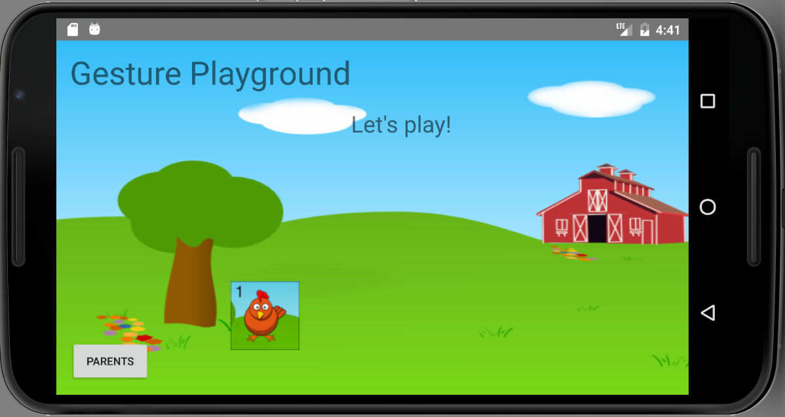
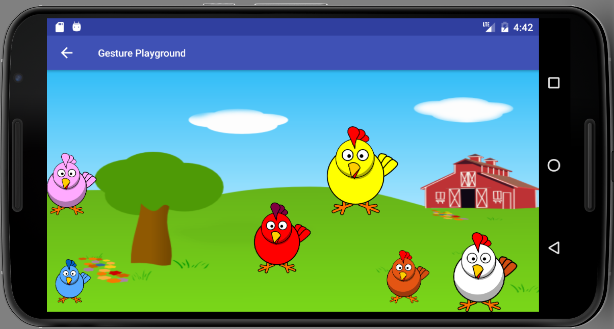

##Project Name
Gesture Playground

##Description
Gesture Playground is an app to teach toddlers the gestures needed on android devices. Toddlers learn best by playing and doing actions. Each level will have a miniature instructional piece. Then the toddler will then practice/play with that gesture on the level.

##Technologies
Android Studio, Java, GestureDetector, MediaPlayer

##Current Features
* Play area for each gesture.
* Video tutorials for each level.

##Future Features
* Add levels covering more gestures, for example, swipe, pinch, two finger tap.

##Usage
* Open Android Studio
* Click on "Check out project from Version Control"
* In the popup that appears, click on Git
* Enter the Git Repo details: https://github.com/Mehequanna/GesturePlayground
* Check everything by clicking "Test"
* Then click "clone"
* Follow the prompts. Note: There may need to be some refactoring on your end based on your version of Android Studio.

##Known Issues

##Author
Stephen Emery

##License
This work can be used under the MIT License.
Copyright (c) 2016 Stephen Emery
