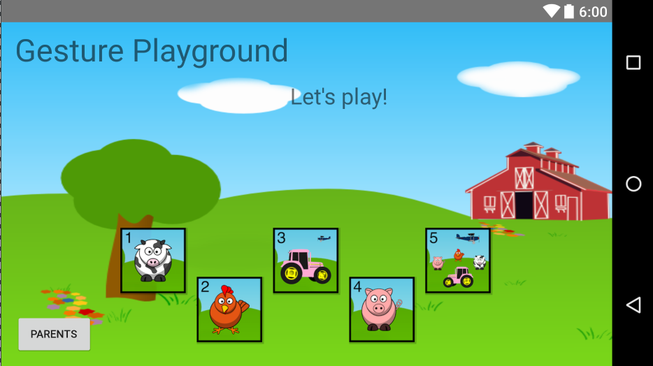
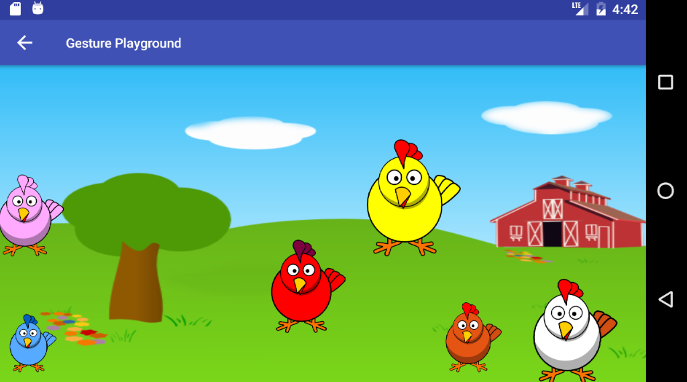
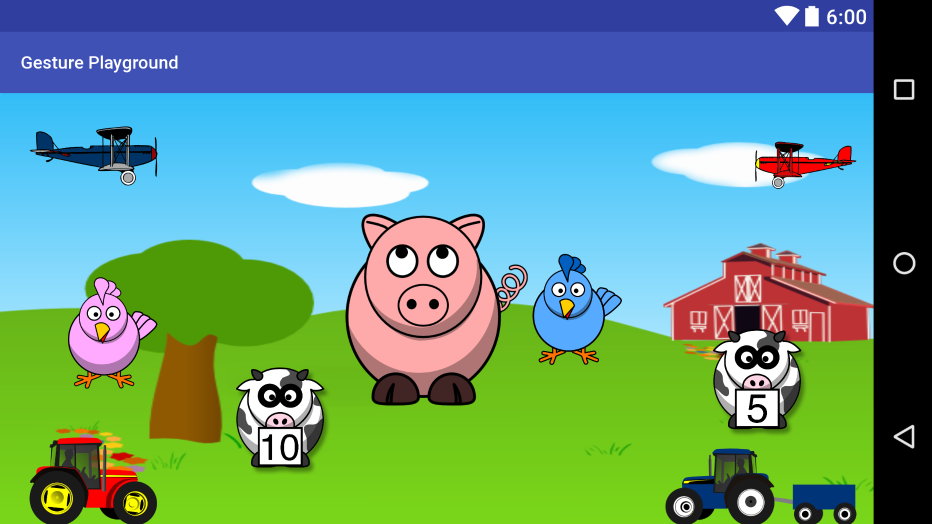

##Project Name
Gesture Playground

##Description
Gesture Playground is an app to teach toddlers the gestures needed on android devices. Toddlers learn best by playing and doing actions. Each level will have a miniature instructional piece. Then the toddler will practice/play with that gesture on the level.

Main Activity:

Level 2:

Level 5:

##Technologies
Android Studio, Java, XML, GestureDetector, MediaPlayer

##Current Features
* Play area for each gesture, tap, double tap, swipe (left/right), and fling.
* Video tutorials on each level.

##Usage
* Open Android Studio
* Click on "Check out project from Version Control"
* In the popup that appears, click on Git
* Enter the Git Repo details: https://github.com/Mehequanna/GesturePlayground
* Check everything by clicking "Test"
* Then click "clone"
* Follow the prompts. Note: There may need to be some refactoring on your end based on your version of Android Studio.

##Future Features
* Parents: Add preference to remove videos.

##Known Issues
* Refactor: Put repeat code into methods.
* Fix Error: Video Error (1,-38) on API 21

##Resource Attributions
Vocabulary sounds found on https://www.freesound.org/people/margo_heston/. These sounds are very well done!
Clip art found on http://www.clker.com/. It's a great resource for clip art!

##Author
Stephen Emery

##License
This work can be used under the MIT License.
Copyright (c) 2016 Stephen Emery
